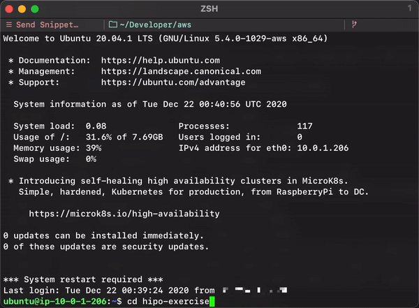

# hipo-exercise
  A recipe sharing website.
## Prerequisites
  You must have a PostgreSQL setup containing a database named hipo-exercise.
  
  You must have a AWS S3 bucket and API keys to access it.
  Change the following variables in hipo_exercise/settings.py according to your configuration.
  `ALLOWED_HOSTS` must include your FQDN or VM IP address
  ```python
  ALLOWED_HOSTS
  AWS_STORAGE_BUCKET_NAME
  AWS_S3_CUSTOM_DOMAIN
  ```
## Installation
  Spin up a ubuntu virtual machine.
  
  To set the required enviroment variables,
  execute the following command on your vm shell:
  ```shell
  nano .pam_environment
  ```
  Type in the variables in the following format:
  ```shell
  VARIABLE_NAME=something
  VARIABLE_NAME2=something
  ```
  The required enviroment variables are the following. You can use https://djecrety.ir to generate the Django `SECRET_KEY`.
  ```shell
  SECRET_KEY
  DB_USERNAME
  DB_PASSWORD
  DB_HOST
  DB_PORT
  AWS_ACCESS_KEY_ID
  AWS_SECRET_ACCESS_KEY
  ```
  Save with `ctrl-c` followed by `enter`. Quit with `ctrl-x`.
  
  Make sure to logout to activate the enviroment variables. This is very important.
  ```shell
  logout
  ```
  Log back in and then clone this repository:
  ```shell
  git clone https://github.com/alphelvaci/hipo-exercise.git
  ```
  Change your working directory to the project directory:
  ```shell
  cd hipo-exercise
  ```
  Make the installation script executable:
  ```shell
  chmod +x install.sh
  ```
  Finally, run the installation script:
  ```shell
  ./install.sh
  ```
  
